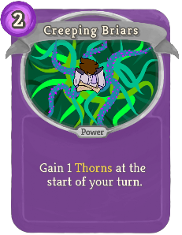
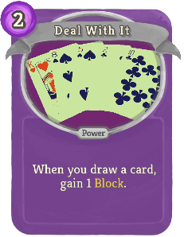
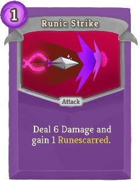
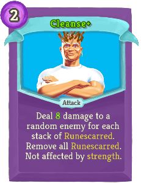
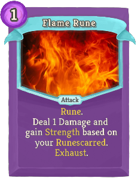
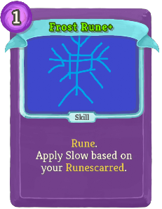
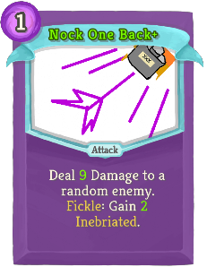
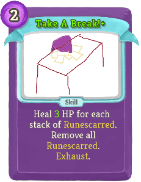
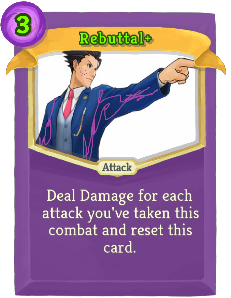
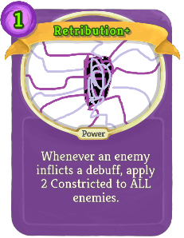

## Cards

| Name | Image | Upgraded image | Rarity | Type | Cost | Description |
| ---- | ----- | -------------- | ------ | ---- | ---- | ----------- |
| Curse Rune |  |  | Curse | Curse |  | Unplayable. basilmod:Rune. At the end of your turn, lose !basilMod:RunescarredValue! HP. Exhaust. |
| Counter |  |  | Basic | Skill | 0 | If the enemy intends to attack, gain 2(4) Thorns. |
| Defend |  |  | Basic | Skill | 1 | Gain 5(8) Block. |
| Quick Draw |  |  | Basic | Attack | 0 | Deal 4(5) Damage and draw 1(2) card(s). |
| Strike |  |  | Basic | Attack | 1 | Deal 6(9) Damage. |
| Research |  |  | Special | Power | X | The next X cards you draw cost 1(2) less this combat. |
| Caffeine Jitters |  |  | Common | Attack | 1 | Deal 3(4) Damage to a random enemy for each stack of basilmod:Caffeine gained this combat. |
| Coin Toss |  |  | Common | Attack | 0 | Deal 3(5) Damage. basilmod:Fickle: Add a copy of this card to the top of your draw pile. |
| Counterbuff |  |  | Common | Skill | 1 | If the enemy intends to buff, apply 1(2) basilmod:Rust. |
| Counterspell |  |  | Common | Skill | 1 | If the enemy intends to debuff, gain 1(2) Artifact. |
| Counterstatus |  |  | Common | Power | 2 | When you draw a Status, gain 5 Block (and Thorns). |
| Cover Page |  |  | Common | Skill | 1 | Gain 3(5) Block and draw a card. basilmod:Fickle: Gain 5(7) Block (not affected by Dexterity). |
| Creeping Briars |  |  | Common | Power | 2 | Gain 1(2) Thorns at the start of your turn. |
| Crow Cloak |  |  | Common | Power | 2(1) | Gain 2 Dexterity. |
| Deal With It |  |  | Common | Power | 2 | When you draw a card, gain 1(2) Block. |
| Inscribe |  |  | Common | Skill |  | Unplayable. basilmod:Fickle: Gain 1(2) basilmod:Runescarred. |
| Kaluha |  |  | Common | Skill | 1 | Gain 1(2) basilmod:Caffeine and basilmod:Inebriated. |
| Long Draw |  |  | Common | Attack | 2 | Deal 10(15) Damage and draw 1 card. |
| Papercut |  |  | Common | Attack | 1 | Deal 2(3) Damage 3(4) times. |
| Runic Defend |  |  | Common | Skill | 1 | Gain 5(7) Block and 1(2) basilmod:Runescarred. |
| Runic Strike |  |  | Common | Attack | 1 | Deal 6(8) Damage and gain 1(2) basilmod:Runescarred. |
| Shuffle Notes |  |  | Common | Skill | 1(0) | Draw 3(4) cards. |
| Sip |  |  | Common | Skill | 0 | Gain 1 basilmod:Caffeine (and heal 1 HP). |
| Slurp |  |  | Common | Skill | 1 | Gain 1(2) basilmod:Inebriated. |
| Another Book |  |  | Uncommon | Skill | 0 | Add a (an upgraded) random skill to your hand. Exhaust. |
| Blank Rune |  |  | Uncommon | Skill | 1 | basilmod:Rune. Copy the effects of another basilmod:Rune in your deck. Exhaust. (not Exhaust.) |
| Cawcawphony |  |  | Uncommon | Attack | 2 | Deal 2(3) Damage to a random enemy 10 times. |
| Cleanse |  |  | Uncommon | Attack | 2 | Deal 5(8) damage to a random enemy for each stack of basilmod:Runescarred. Remove all basilmod:Runescarred. Not affected by strength. |
| Coffee |  |  | Uncommon | Power | 3(2) | Gain 2 basilmod:Caffeine each turn. |
| Due Date |  |  | Uncommon | Skill | 2(1) | Innate. Can only be played if enemy is at full HP. If you defeat this enemy within !basilMod:DueDateValue! turns (10% of Enemy's HP), gain !basilMod:DueDateValue! Max HP. Exhaust. |
| Earth Rune |  |  | Uncommon | Skill | 1 | basilmod:Rune. Gain !basilMod:RunescarredValue! block per enemy. Exhaust. (not Exhaust.) |
| Experiment |  |  | Uncommon | Skill | 1 | Add basilmod:Research (basilmod:Research+) to your hand and Exhaust. basilmod:Fickle: Draw 2(3) cards. |
| Faerie Dust |  |  | Uncommon | Attack | 1(0) | Deal 3(4) Damage for each enemy in combat. basilmod:Fickle: Deal 3(4) Damage to all enemies. |
| Flame Rune |  |  | Uncommon | Attack | 1 | basilmod:Rune. Deal 1 Damage and gain !basilMod:RunescarredValue! Strength. Exhaust. (not Exhaust.) |
| Frost Rune |  |  | Uncommon | Skill | 1 | basilmod:Rune. Apply !basilMod:RunescarredValue! Slow. Exhaust. (not Exhaust.) |
| Lightning Rune |  |  | Uncommon | Attack | 1 | basilmod:Rune. Deal !basilMod:RunescarredValue! Damage to all enemies. Exhaust. (not Exhaust.) |
| Nightmares |  |  | Uncommon | Skill |  | Unplayable. At the end of your turn, gain 5(10) Thorns. basilmod:Fickle: Take 5(10) Damage. |
| Nock One Back |  |  | Uncommon | Attack | 1 | Deal 7(9) Damage to a random enemy. basilmod:Fickle: Gain 1(2) basilmod:Inebriated. |
| Robin Hood |  |  | Uncommon | Attack | 1 | Deal 6(9) Damage and gain 1(2) gold for each point of unblocked damage. |
| Rope Arrow |  |  | Uncommon | Attack | 2(1) | Deal 3 Damage and apply 3 Constricted. |
| Runeburn |  |  | Uncommon | Power | 2 | (Innate.)  At the end of your turn, do damage equal to your basilmod:Runescarred to a random enemy. |
| Shots! |  |  | Uncommon | Attack | 1 | Deal 3(5) Damage to ALL enemies. If you have basilmod:Inebriated, increase this damage by 2(3). |
| Sleepless Night |  |  | Uncommon | Skill | 2(1) | Apply 2(3) Vulnerable and Weak to all enemies. basilmod:Fickle: Lose [E] and gain 2 basilmod:Caffeine. |
| Take A Break! |  |  | Uncommon | Skill | 2 | Heal 2(3) HP for each stack of basilmod:Runescarred. Remove all basilmod:Runescarred. Exhaust. |
| Whiskey |  |  | Uncommon | Power | 3(2) | Gain 2 extra Strength and Dexterity from basilmod:Inebriated . |
| Astral Brew |  |  | Rare | Skill | 2(1) | Gain 1 Intangible. |
| Crow Rune |  |  | Rare | Power | 2 | basilmod:Rune. Gain !basilMod:RunescarredValue! Flight. Ethereal. (not Ethereal.) |
| Fae Form |  |  | Rare | Power | 3(2) | At the end of your turn, gain a random amount of one of the following: Thorns, Artifact, Strength, or Dexterity. basilmod:Fickle: Draw a card. |
| Faerie Rune |  |  | Rare | Power | 2 | basilmod:Rune. If you would die, Heal a percent of your Max HP based on your current basilmod:Runescarred. Ethereal. (not Ethereal.) |
| Finals Week |  |  | Rare | Attack | 7 | This card's cost cannot be externally modified. Deal 7 Damage 7 times to all enemies and Exhaust. basilmod:Fickle: Reduce this card's cost by 1(2). |
| Mixed Bag |  |  | Rare | Skill | 1 | Draw 3 (Upgraded) basilmod:Runes. |
| Naptime |  |  | Rare | Skill | 3(2) | Put all enemies to sleep. Exhaust. |
| Procrastinate |  |  | Rare | Skill | 0 | Every time you draw this card, increase its effects by 1(2). Gain !basilMod:MiscValue! stacks of basilmod:Regen, Strength, and Dexterity. Exhaust. |
| Rebuttal |  |  | Rare | Attack | 4(3) | Deal Damage equal to an enemy's intended damage. |
| Retribution |  |  | Rare | Power | 2(1) | Whenever an enemy inflicts a debuff, apply 2 Constricted to ALL enemies. |
| Runic Overload |  |  | Rare | Skill | 2 | Double (Triple) your basilmod:Runescarred. Exhaust. |

## Potions

| Image | Name | Rarity | Description |
| ----- | ---- | ------ | ----------- |
|  | Coffee Potion | Common | Gain 1 Caffeine at the start of each turn. |

## Relics

| Image | Name | Rarity | Color | Description | Flavor |
| ----- | ---- | ------ | ----- | ----------- | ------ |
|  | Scholar's Notes | Starter | Basil_purple_color | At the start of combat, choose a card to add to your hand from your deck. | The deranged writings of a scholar well behind on his grant proposals. |
|  | Endless Mug | Uncommon | Basil_purple_color | When you would gain [E] from #yCaffeine, gain [E] [E] instead. | Sleep is for people without infinite coffee. |
|  | Trick Coin | Uncommon | Basil_purple_color | #yFickle cards are #g25% #gless likely to activate on heads, and #r25% #rmore likely to activate on tails. Right click to flip. | Who needs luck when you can cheat? |
|  | Scholar's Thesis | Boss | Basil_purple_color | Every 3 turns, choose a card to add to your hand from your deck. NL Replaces Scholar's Notes. | I sure hope that angel got their degree. |

| Image | Name |
| ----- | ---- |
|  | the Scholar |

